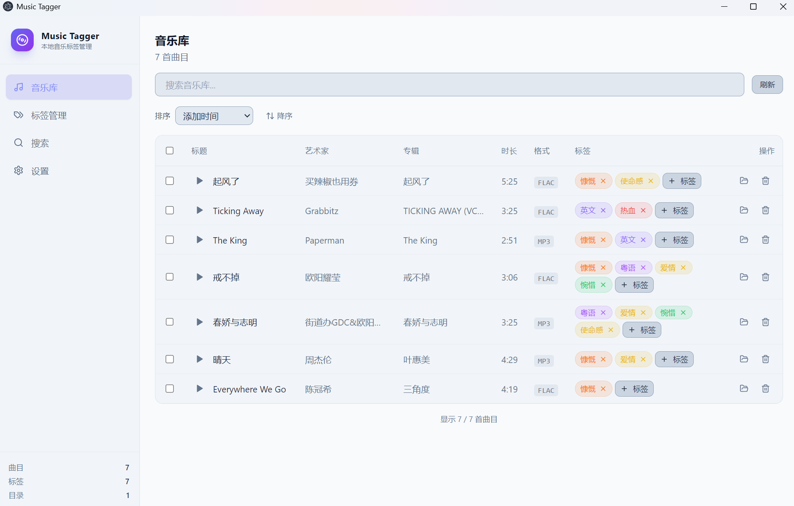
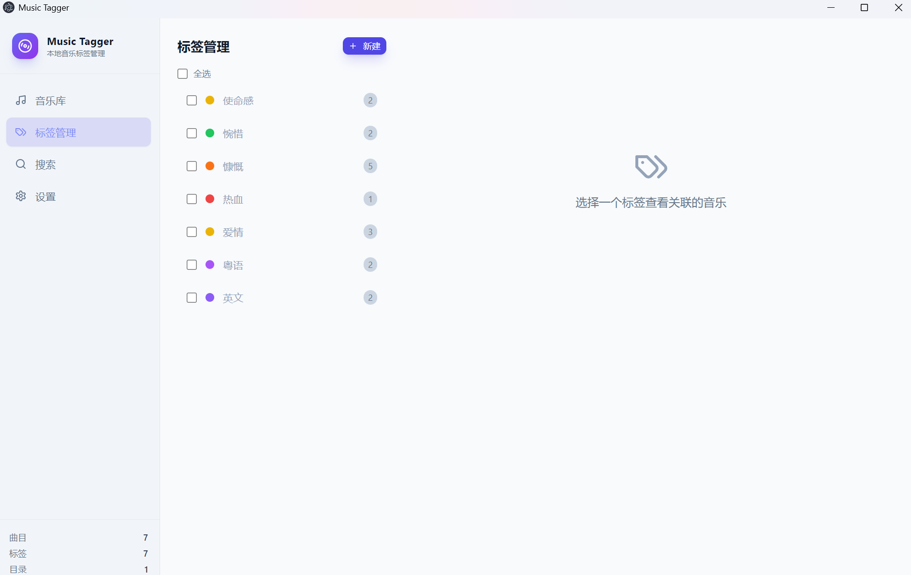
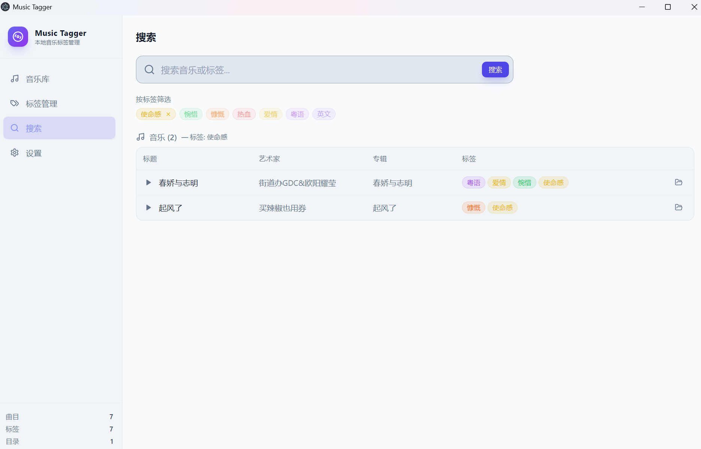

# 🎵 Music Tagger

<div align="center">

A sleek **Windows desktop app** for tagging and organizing your local music collection — built with Electron, React, and SQLite.

[](https://electronjs.org/)
[](https://react.dev/)
[](https://www.typescriptlang.org/)
[](https://tailwindcss.com/)
[](./LICENSE)

> 🧑‍💻 Built entirely by a **16-year-old middle school student** using **Claude Code** + **DeepSeek V4 Pro** — zero lines of hand-written code.

[**中文版本**](./README.md)

</div>

---

## ✨ Features

<div align="center">

| Music Library | Tag Manager | Search |
|:---:|:---:|:---:|
|  |  |  |

</div>

| Category | Details |
|----------|---------|
| 🎶 **Music Library** | Sortable table with search, batch tagging, batch delete, drag-out to copy files |
| 🏷️ **Tag Management** | Full CRUD for colored tags, view tracks by tag, batch delete |
| 🔍 **Search** | Unified text search across track metadata + tag-name intersection |
| ⚙️ **Settings** | Scan directories, change DB location, light/dark theme |
| 📥 **Drag & Drop** | Drop audio files to import them, drag tracks out to Explorer |
| 🔊 **Player** | Bottom bar with seek & volume sliders, sequential or shuffle playback |
| 📊 **Play Stats** | Tracks play count and last-played time, sort by usage |

## 🚀 Quick Start

### 💾 Download (Recommended)

Go to the [Releases](https://github.com/Tangelle/Music-Tagger-/releases) page and download the latest `Music Tagger X.X.X.exe` — **portable, just double-click, no installation needed**.

### 🛠️ Build from Source

```bash
git clone <repo-url> && cd music-tagger
npm install
npm run dev          # launches Vite + Electron side-by-side
```

The app window opens at `http://localhost:5173` with hot-reload.

```bash
npm run build        # portable .exe in release/
```

> **Prerequisite:** Node.js ≥ 18 (Windows).

## 🧱 Architecture

```
┌─────────────────────────────────┐
│  Renderer (React 18 + TS)       │
│  window.api.*   ◀──────────────▶│  contextBridge
├─────────────────────────────────┤
│  Main Process (Node.js / CJS)   │
│  ipcMain handlers               │
│    ▶ trackService / tagService  │
│    ▶ searchService / scanner    │
├─────────────────────────────────┤
│  sql.js (SQLite → WASM)         │
└─────────────────────────────────┘
```

**Strict IPC boundary** — the renderer never touches `fs`, `db`, or Node APIs directly.

## 📁 Project Structure

```
music-tagger/
├── main-process/           # Electron main process (CommonJS)
│   ├── main.js             # BrowserWindow + app lifecycle
│   ├── preload.js          # contextBridge API surface
│   ├── ipcHandlers.js      # ipcMain.handle registry
│   ├── database.js         # sql.js wrapper + schema migration
│   ├── scanner.js          # Recursive music-file scanner
│   ├── trackService.js     # Track CRUD
│   ├── tagService.js       # Tag CRUD
│   └── searchService.js    # Search + stats
├── src/                    # Renderer (React + TypeScript)
│   ├── components/         # Sidebar, AudioPlayer, TagBadge, TagSelector
│   ├── hooks/              # useTheme, useDragDrop
│   ├── pages/              # MusicLibrary, TagManager, SearchPage, SettingsPage
│   ├── App.tsx             # Root component
│   ├── types.ts            # Window.api type declarations
│   ├── index.css           # Tailwind + CSS-variable theme
│   └── main.tsx            # React entry
├── index.html              # HTML shell
├── package.json
└── tsconfig.json
```

## 🗄️ Database Schema

| Table | Columns |
|-------|---------|
| `tracks` | `id`, `file_path` (unique), `title`, `artist`, `album`, `duration`, `format`, `file_size`, `added_at`, `last_used_at`, `play_count` |
| `tags` | `id`, `name` (unique), `color`, `created_at` |
| `track_tags` | `track_id` → tracks, `tag_id` → tags (FK cascade) |
| `scan_dirs` | `id`, `dir_path` (unique), `added_at` |

## 🛠️ Tech Stack

| Layer | Technology |
|-------|-----------|
| Framework | Electron 28 |
| Frontend | React 18 · TypeScript 5 · Tailwind CSS 3 |
| Database | sql.js (SQLite compiled to WASM) |
| Icons | lucide-react |
| Audio metadata | music-metadata |
| Build | Vite 5 · electron-builder (portable) |

## 📦 Scripts

| Command | Description |
|---------|-------------|
| `npm run dev` | Dev server + Electron concurrently |
| `npm run vite:dev` | Vite dev server only (port 5173) |
| `npm run electron:dev` | Electron only (requires Vite running) |
| `npm run build` | Production build → portable `.exe` |
| `npm run vite:build` | Frontend build only → `dist/` |

## 🎨 Theming

Dark mode is the default. Toggle via the sidebar button — preference is persisted in `localStorage` and applied via an inline `<script>` **before paint** to eliminate flash. Theme uses CSS custom properties (`--s-*` for surfaces, `--tx-*` for text) controlled by a `.dark` class on `<html>`.

## 📄 License

MIT
